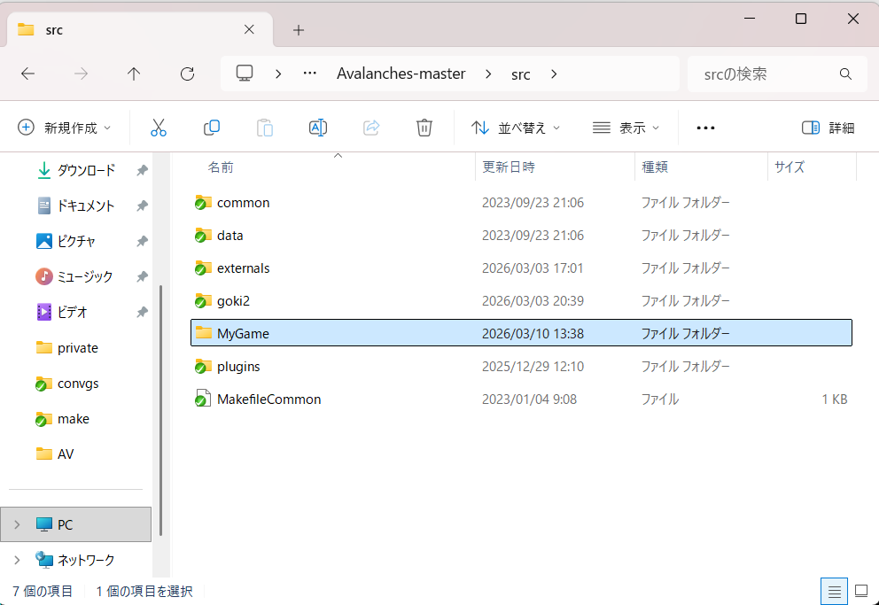
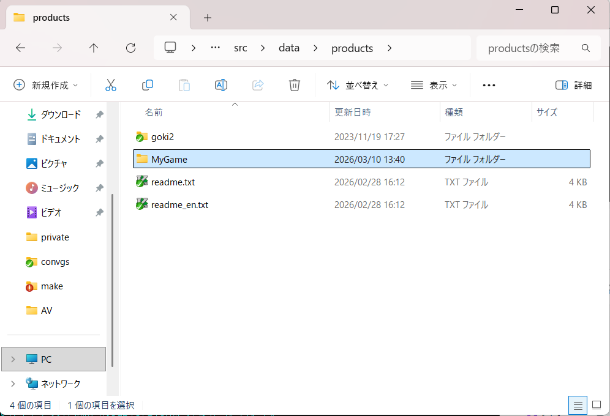

## これは何？  
 マスターデータやパッチを作成するツールです。  

## 使い方  

 １．config.iniファイルを編集します。  
 ２．test.batをコピーしてファイル名をわかりやすいもの（説明のためMyGame.batとする）に変更します。  
 ３．MyGame.batをエディタで開く。  
 ４．MyGame.batのターゲット（goki2）をMyGameで置換します。  
 ５．MyGame.batを実行します。  

 実行結果として work_MyGame というフォルダが出力されますがこれは無視して構いません。  
 最終的には /dist/MyGame/ に最終バイナリ（マスターデータ等）が出力されます。  

## その他  

 あなたのプロジェクトのソースが/src/MyGameにある場合、ターゲットは"MyGame"となります。  

  

 またインストールするバイナリなどを配置するフォルダは /src/data/products/MyGame/ 以下に配置してください。  

  

 インストールするバイナリなどについて、詳しくは /src/data/products/readme.txt を参照してください。  

 また、最終バイナリに対してアップデートプログラムを作成する事ができます。  
 このアップデートプログラムの内容は１から始まる連番で管理されています。  
 詳しくは config.ini の UPDATEINFO セクションの説明を参照してください。  
 ちなみに差分ファイルの収集にはSubversionのログを利用しています。  
 そのためパッチの作成にはSubversionが必要になります。  
 詳しくは /readme.txt を参照してください。  

 その他の詳しい使い方はヘルプを参照してください。  

 `ruby make.rb -h`  

## 依存関係

 RubyGem inifile >= 2.0.2  

 インストール方法：  
  Windowsキー+Rを押してcmdを入力してエンター  
  コマンドプロンプトに以下を入力してエンター  

  `gem install inifile`  

